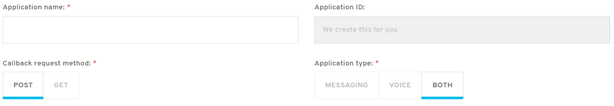

# bandwidth-shared-components
Shared Component Library for Bandwidth React Apps

## [Documentation](http://dev.bandwidth.com/shared-components)

# How to use this library

Install the library as an NPM module. `npm i --save @bandwidth/shared-components`

Add the `BandwidthThemeProvider` to the root of your React component structure:

```javascript
import { BandwidthThemeProvider } from '@bandwidth/shared-components';

...

<BandwidthThemeProvider>
  <MyApp />
</BandwidthThemeProvider>
```

Now you can start including the components in your code. Require them by traversing the directory structure of the module:

```javascript
import { Button } from '@bandwidth/shared-components'`;
```

If you want to make this easier, you can alias the module in Webpack:

```javascript
resolve: {
  modules: ['node_modules'],
  alias: {
    'shared-components': '@bandwidth/shared-components',
  },
  extensions: ['.js', '.jsx'],
},
```

With this alias, you could just type:

```javascript
import { Button } from 'shared-components';
```

# The Flow Layout System



Built into the library is a layout system which is designed to easily create experiences according to Bandwidth's design guidelines. You can read more in the [Flow docs](https://github.com/Bandwidth/shared-components/blob/master/src/layouts/Flow/Flow.md)

# Additional Components

Besides the components listed in our design system, this library contains a few extras:

* Header/SubHeader: different sized header texts
* Gutter: a div with a gutter-styled background
* Money: takes a currency value and renders it with special effects and proper formatting
* NewBadge: a little badge indicating a new item
* Code/MethodTag: a colored HTTP method verb tag

# License

The source of this library is licensed under the MIT license (see [LICENSE](./LICENSE))

Bandwidth and the BW logo are trademarks of Bandwidth.com, Inc.  Bandwidth reserves all rights to these trademarks, as well as any others that may be included from time to time.
